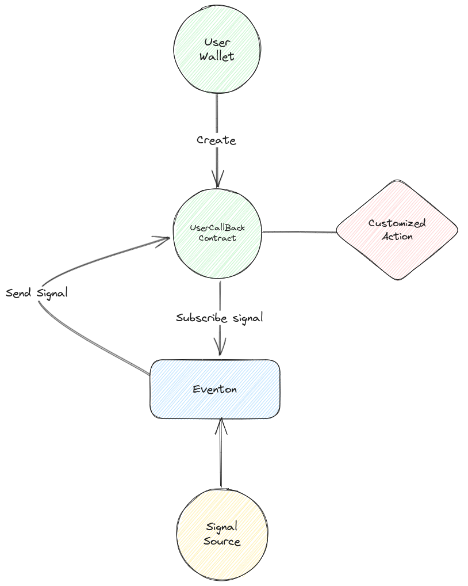

# Eventon

[](https://ton-dynasty.github.io/eventon-doc/)
[](https://t.me/+5affnJVZV4I4MTI1)
[](https://google.com)

<p align="center">

</p>

## Overview

> [Docs](https://ton-dynasty.github.io/eventon-doc/)

## What is Eventon?

-   **Ton-Dynasty** has designed a protocol that can achieve the following two functionalities:
    -   **On-Chain Functionality**: Users can subscribe to events occurring on-chain, including:
        -   DeFi protocols
        -   Oracles
        -   Airdrop events
        -   Other smart contracts
    -   **Off-Chain Functionality**: Through off-chain computations, signals are transmitted to on-chain contracts to execute related programs, including:
        -   Smart contract vulnerability detection
        -   Machine learning-based intelligent position signals
        -   Blacklist monitoring
        -   Whale account transfer notifications

Users can customize their own code or utilize built-in smart contracts to automatically execute program operations when specific signals are received.

> **Every thing is a _SIGNAL_.**

For example, a change in the status of a DeFi protocol, a price provided by an Oracle, a user's transaction, or an airdrop event can all be considered a **_SIGNAL_**.

## What Can We Do with Eventon?

For example, users can use Eventon to subscribe to an Oracle and set it up so that when the Oracle emits the price of ETH at $1600 USD, Eventon will automatically execute the user's custom actions.

## Add Stake for Earning

Any user can add stake for earning by simply staking a certain amount of TON on Eventon, which allows them to receive a corresponding reward in TON.

## Workflow

The workflow of Eventon is depicted in the following diagram:



## Project structure

-   `contracts` - source code of all the smart contracts of the project and their dependencies.
-   `wrappers` - wrapper classes (implementing `Contract` from ton-core) for the contracts, including any [de]serialization primitives and compilation functions.
-   `tests` - tests for the contracts.
-   `scripts` - scripts used by the project, mainly the deployment scripts.

## Deployment

`deployer`: EQB_IbNTgL7I1pcVTOn_hpu90k2glmf9e1B17u55W4_eeKxe
`Universal Router`: EQABJ7PW-xIZT9pOEwxJI_QjraFK-MlxkxhhmUsuAItl6Ewe
`Event Source (Bug Detector)`: EQAHm1BCcGDPC2fgRzLHxEIUe0PheW03NcHhA1_YuWhm_qyJ
`UserDefaultCallback (Bug Detector)`: EQCaI2cv9SrMJC8UyuNQrzIRtxm9VYegiomsCiUCOF3WlH-e

## Develop Guide

### Build

```bash
yarn
yarn build
```

### Test

```bash
yarn test
```

### Deploy or run another script

```bash
npx blueprint run
```

### Add dependency

> for contract

```bash
yarn add -W typescript
```

> for monorepop @eventon/sdk

```bash
yarn workspace @eventon/sdk add typescript -D
```
